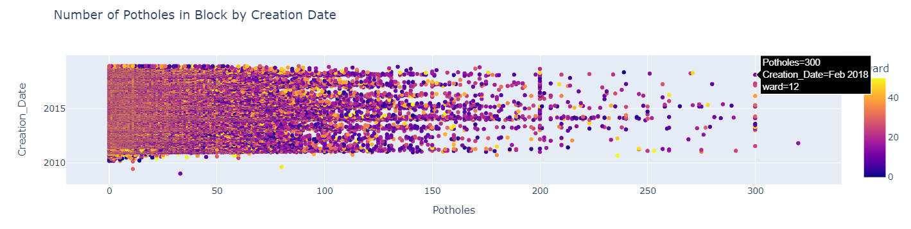
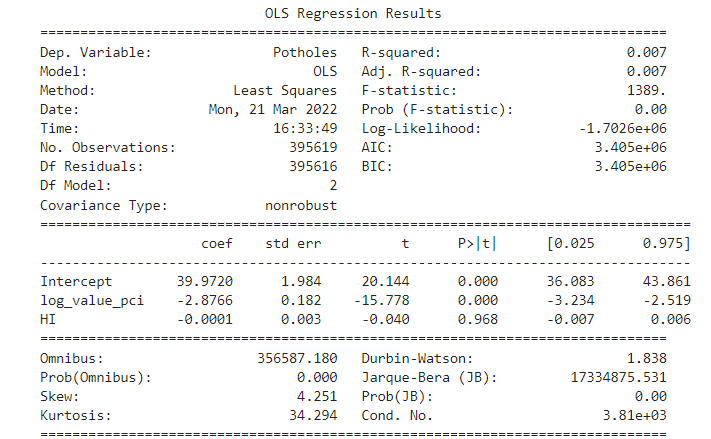

# Chicago Potholes Data (2011 - 2017) or some better title
Requirements for reporting your analysis:

The goal of the analysis is must be clearly articulated
The report must include your methodology
The report must include a description of your project and its findings (or lack of findings)
Your findings (or non-findings) must be clearly documented
The limitations of the analysis must be clearly outlined
Extensions of your analysis or areas for more research must be included in your report
You should not include analysis, plots, discoveries, that aren’t directly related to your findings – you can put them as an appendix in another file if you like

## Analysis: Completion Time and Per Capita Income
The code for this part of the analysis can be found [here](code/census-pot.ipynb).
The idea was an exploration of the relationship between pothole completion times and income in Chicago's 77 community zones. First, the `Completion Time` variable was created by subtracting `Creation Date` from `Completion Date`. Then the `potholes` dataset was grouped by `Community Area`, where we calculated the total counts of potholes and the mean completion time of potholes by community area. This data frame was then merged with the `census_data` data frame into a final form `working_data`, which has each community area and community area name along with their per capita incomes, total counts of potholes over the years, and average completion time.

To visualize this analysis, a scatterplot was created with `Per Capita Income` on the x-axis and `Completion Time` on the y-axis .
In the scatterplot, the color scale is by number of potholes, with the darkest points having the fewest number of potholes and the lighest points having the most potholes in that community zone. We see that in areas with the lowest incomes, even having a smaller number of potholes than in richer areas results in a slower average completion time.

In the following two plots, the per capita income of the neighborhoods with the top 5 longest completion times and top 5 shortest completion times are shown. These metrics were calculated by viewing `working_data.head() ` and `working_data.tail()`. It seems that the incomes of neighborhoods with longer completion times are higher, but this analysis does not include other confounding variables, such as the population of each community area. 

## Analysing the Pothole data and Income Data for the Chicago area: 
To see the code for this part of the analysis, please refer to the following [link](Data_Cleaning/pothole_data/Pothole_data.ipynb). This uses Pothole [data](data/potholes_1.csv) from the Chicago area.
Through this code I perform some simple data cleaning commands for the Potholes dataset by changing messy names of columns, sorting some of the variables by first name and dropping duplicate values. I also replace missing values for the numberical columns with either the mean, mode, the value of zero, or a prespecified value. I check to make sure that none of the columns have any null entries in them. The I go ahead and perform some simple statistics for the pothole data to show the mean, std, min, max and the 25%, 50% and 75% quantiles for each variable in the dataset. I create a [correlation table](artifacts/PotholeData_statistics.png) among variables in the dataset, and lastly, I create a [scatterplot](artifacts/Scatter_plot.png) that shows Number of Potholes in Block by Creation Date. 

I also look at the income [data](data/chicago_census_data.csv) in the Chicago area by first merginig it with the pothole data. I perform a simple regression between the potholes as the dependent variable and the Per Capita Income and Hardship Index as the independent variables. The result is the following [table](artifacts/pothole_income_regression.png). In this table we see that a one unit increase in per capita income leads to a decrease of approximately 2.9 units in the number of potholes in the block, a coefficient which is statistically significant. Similarly, we see that a one unit increase in the hardship index leads to a decrease of approximately 0.001 in the number of potholes in the block, a coefficient which is nonetheless not statistically significant.

## Analysis: Arrests and Potholes
The code used for the analysis can be found [here](code/arrestdata.ipynb).
The motivation was that for each police district, there might be more intense activities where the arrests happen more which might lead to increased numbers of potholes. As the arrest data was available for 2014-2017, I focused on the years of 2014-2017 in the potholes data. I grouped the data and counted all the arrests and created potholes in those years and plotted them by police districts.

Unfortunately, it does not seem they are closely correlated.
